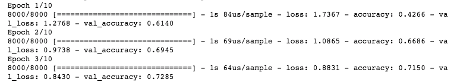

*Dans cet article, nous allons étudier le comportement d'un réseau de neurones classique puis nous construirons un modèle capable de prédire le succès de projets de crowdfunding grâce à Tensorflow 2.0.*

---

### Sommaire  
**I. Comprendre et implémenter un réseau de neurones**  
• Forward Propagation  
• Back Propagation  

**II. Implémentation avec Tensorflow 2.0**  
• Forward Propagation  
• Back Propagation  
• Préparation du jeu de données et entraînement  

**III. Pistes d'amélioration du modèle**

---

## I. Comprendre et implémenter un réseau de neurones

Les réseaux de neurones sont le nerf de la guerre du Deep Learning. Théorisés depuis une cinquantaine d'années, ils sont longtemps restés déceptifs avant de revenir en force grâce à la puissance de calcul des nouveaux ordinateurs. En détectant des *patterns* parfois invisibles pour les humains, ils permettent une compréhension des données qui dépassent parfois les meilleures *heuristiques*. Ainsi, dans le domaine de l'image processing par exemple, les réseaux de neurones se sont mis à produire des résultats supérieurs à des détecteurs aux règles établies par des experts métiers.

Pour comprendre comment tout cela fonctionne, commençons à l'échelle d'un neurone. Le processus se fait en deux grandes étapes, la <mark>**Forward Propagation**</mark> et la <mark>**Back Propagation**</mark>.

### Forward Propagation :  


1. Le réseau de neurones va prendre les différentes features comme *inputs*.

2. Ces *inputs* sont multipliées par leur *poids* respectif. Ce poids est initialisé selon certaines méthodes (comme celle de Xavier ou celle de He) et sera actualisé durant l'entraînement pour donner plus ou moins d'importance à la feature.

3. On réalise alors une somme pondérée, c'est-à-dire une somme de ces multiplications.

4. Cette somme est ensuite donnée à une *fonction d'activation* qui formate et retourne la prédiction en *output*.

### Back Propagation :  
5. Cette prédiction va être comparée à la valeur attendue pour déterminer une mesure de l'erreur, la *loss*.

6. La contribution à l'erreur de chaque neurone de la couche précédente va être déterminée 

5. Une fonction *optimizer* (telle que la descente de gradient) va chercher à minimiser la *loss* calculée.

6. Le *gradient* établi va permettre au réseau d'actualiser les *poids* initiaux avant de relancer le processus x fois (avec x le nombre d'*epochs* fixés pour l'entraînement).

Ce processus peut non seulement se répéter mais également être multiple au sein même du réseau. On  peut en effet ajouter plusieurs couches pour complexifier le modèle et le rendre plus puissant. Ces couches intermédiaire sont appelées *hidden layers*. Plus on ajoute de couches, plus le réseau devient profond. C'est la raison pour laquelle on parle de Deep Learning.


---

## II. Implémentation avec Tensorflow 2.0

Pour implémenter notre premier réseau de neurone, nous allons utiliser la nouvelle version de *Tensorflow*, j'ai nommé *Tensorflow 2.0*. La librairie a l'avantage d'absorber l'excellente API *Keras* qui facilite grandement la construction du modèle. Initialisons un modèle séquentiel à couches.

```python
from tensorflow.keras.models import Sequential # pour créer un modèle
from tensorflow.keras.layers import Dense # pour ajouter des couches

# Initialiser le modèle
classifier = keras.Sequential()
```

### Forward Propagation :  

Nous ajoutons les différents *layers* avec <code>.add(Dense())</code>. Il n'y a pas de règle quant au nombre de layers, cela relève de l'intuition face à la problématique et de l'expérimentation. Ici nous en générons trois.

```python
classifier.keras.add(Dense(units=5, activation='relu', input_dim=9)) # input layer
classifier.add(Dense(units=3, activation='relu')) # hidden layer
classifier.add(Dense(units=1, activation='sigmoid')) # output layer
```

- <code>input_dim</code>: le nombre de features qui serviront d'inputs.
- <code>units</code>: le nombre de neurones (dimension de la couche).
- <code>activation</code>: la fonction d'activation souhaitée.

### Back Propagation :  

Configurons maintenant la *back propagation* avec la fonction <code>.compile</code>. Celle-ci peut prendre un grand nombre d'arguments mais nous nous contentons ici des trois nécessaires pour faire fonctionner le réseau.

```python
classifier.compile(loss='mean_squared_error',
                   optimizer='sgd',
                   metrics=['accuracy'])
```

- <code>loss</code>: fonction d'erreur face au jeu d'entraînement, qu'on va minimiser grâce à l'optimizer.
- <code>optimizer</code>: méthode d'optimisation de la loss qui va permettre l'actualisation des poids. Ici nous utilisons la descente de gradient stochastique (*sgd* pour *stochastic gradient descent*).
- <code>metrics</code>: fonction finale de mesure de l'erreur, face au jeu de test.


### Préparation du jeu de données et entraînement

```python
# Import librairie(s)
import pandas as pd

# Ecriture du fichier .csv dans un dataframe pandas
df = pd.read_csv("../data/data.csv")

# Soit X les features de notre modèle...
X = df
X.drop(['state'], axis=1, inplace=True)

# ...et y la target à prédire
y = df['state']

```

```python
from sklearn.model_selection import train_test_split

# Séparation des données en un jeu d'entraînement et un jeu de test
X_train, X_test, y_train, y_test = train_test_split(X, y, test_size=0.2, random_state=42)
```

On standardise les entrées pour que les différences d'échelle n'aient pas d'impact sur les sommes pondérées du modèle.

```python
from sklearn.preprocessing import StandardScaler

# Standardisation des entrées
scaler = StandardScaler()
X_train = scaler.fit_transform(X_train)
X_test = scaler.transform(X_test)
```

Nous pouvons désormais entraîner notre modèle. On fixe le nombre d'itérations à 20 *epochs* et on place 20% des données dans un jeu de validation qui nous permettra d'évaluer le modèle sur des données qu'il ne connaît pas.

```python
# Entraînement du modèle
history = model.fit(X_train, y_train, epochs=20, validation_split=0.2)
```



On peut constater l'évolution de nos mesures d'erreur sur les jeux d'entraînement et de test. Cela permet notamment de monitorer l'entraînement et de préciser le nombre d'*epochs* nécessaire à l'entraînement de notre modèle.

---

## III. Pistes d'amélioration du modèle

Les principaux facteurs qui déterminent la qualité de l'apprentissage sont les suivants :
- la qualité et la quantité des données utilisées.
- les features proposées au modèle.
- les poids initiaux.
- le nombre de neurones par couches, le nombre de couches.
- le choix de la fonction d'activation.
- le nombre d'epochs (monitorer l'apprentissage).
- faire attention au résultat de l'*optimizer* car la fonction d'erreur est rarement convexe, donc il y a des minimas locaux qui empêchent la descente de gradient (par exemple) de trouver le minima global.