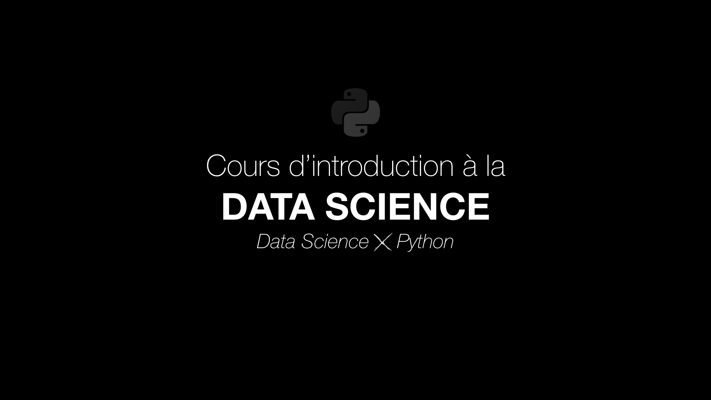

# Data Science *X* Python

# _Sommaire :_

[00. Introduction au Machine Learning](00.%20Introduction%20au%20Machine%20Learning)  
[01. Analyse exploratoire (EDA)](01.%20Analyse%20exploratoire%20(EDA))  
02. Data Cleaning  
03. Inférences statistiques  
04. Features Engineering  
[05. Choisir et optimiser un modèle](05.%20Choisir%20et%20optimiser%20un%20modèle)  
06. Modèles supervisés  
07. Modèles non supervisés  
08. Introduction au Deep Learning  
09. Introduction au Natural Language Processing  
10. Introduction à l'Image Processing  

Bonus1. Introduction aux séries temporelles avec Prophet  
[Bonus2. Introduction à l'analyse de réseau avec NetworkX](Bonus2.%20Introduction%20à%20l'analyse%20de%20réseau%20avec%20NetworkX)  
Bonus3. Introduction au Big Data avec pySpark  
Bonus4. Introduction au requêtage SQL et noSQL  

---

# –– _Sommaire detaillé :_

### [00. Introduction au Machine Learning](00.%20Introduction%20au%20Machine%20Learning)  

**A. Charger et comprendre les données**  
• Des features pour prédire une target  
• Déterminer la méthode de prédiction

**B. Entraîner et évaluer son premier modèle**

### [01. Analyse exploratoire (EDA)](01.%20Analyse%20exploratoire%20(EDA)) 

**A. Analyse univariée**  
• Distribution et Théorème Central Limite  
• Espérance et Moyenne, Médiane, Mode  
• Dispersion : Variance, Écart-type  
• Forme : Skewness et Kurtosis  
• Concentration : Courbe de Lorenz, Indice de Gini  
• Fréquences  
• Bonus : moyennes harmoniques et quadratiques   

**B. Analyse bivariée**  

**C. Analyse multivariée**  

---

### 02. Data Cleaning  
**A. Duplicated and missing values**  
• Gérer les duplicatas  
• Gérer les données manquantes (NaN, null)  

**B. Outliers univariés**   
• Approche visuelle (boxplot)  
• IQR  
• Z-score  
• Sigma-clipping  

**B. Outliers univariés**   
• Approche visuelle (scatterplot)  

---

### 03. Inférences statistiques

---

### 04. Features Engineering 
**A. Transformations**  
• Categorical features  
• Date features  

**B. Créer de nouvelles features**  

**C. Distributions**  
• Log-transformation  
• Scaling, Standardization  

**D. Pour aller plus loin**  
• La réduction dimensionnelle  
• Le clustering  

---

### [05. Choisir et optimiser un modèle](05.%20Choisir%20et%20optimiser%20un%20modèle)

**A. Choisir un modèle**  
• Split  
• Sélection du modèle  
• Validation croisée  
• Compromis biais-variance (under/overfitting)  

**B. Optimiser un modèle (Hyperparameters tuning)**
• GridSearchCV  
• RandomizedSearchCV  

**C. Metrics pour les régressions**  

**D. Metrics pour les classifications**  
• Données déséquilibrées et Approche naïve  
• Les types d'erreurs  
• Matrice de confusion  
• ROC-AUC  

---

### 06. Modèles supervisés

**A. Les modèles de régression**  
• Modèles classiques  
• Méthodes ensemblistes  

**B. Les modèles de classification**  
• Modèles classiques  
• Méthodes ensemblistes  

---

### 07. Modèles non supervisés

**A. Réduction dimensionnelle linéaire**  
• PCA  
• NMF  
• Factor Analysis  

**B. Réduction dimensionnelle non-linéaire**  
• ACP à noyau  
• Clustering hiérarchique  
• K-Means  
• DBSCAN  
• Metrics  

---

### 08. Introduction au Deep Learning  
• Perceptrons et Réseaux de neurones  
• Réseaux de neurones convolutifs (CNN)  
• Réseaux de neurones récurrents (RNN)  

---

### Cheatsheets - Mathématiques
• Biais, Poids et Degrés de liberté  
• Dérivées et Intégrales  
• Dérivées partielles    
• Gradient et Descente de gradient  
• Convexité et Concavité  
• Matrices et déterminant  
• Calculs matriciels  
• Valeurs et Vecteurs propres  

• Concept de probabilité  
• Théorème de Bayes